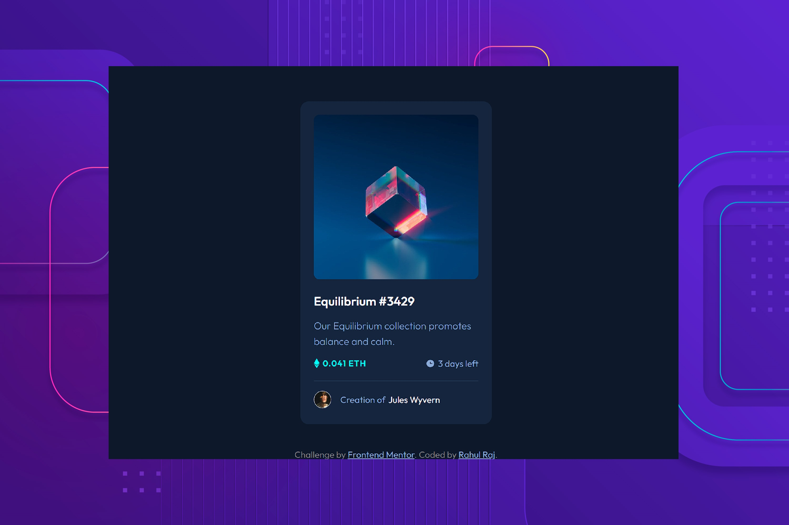

This is a solution to the [NFT preview card component challenge on Frontend Mentor](https://www.frontendmentor.io/challenges/nft-preview-card-component-SbdUL_w0U). Frontend Mentor challenges help you improve your coding skills by building realistic projects.

## Links

- [Solution](https://www.frontendmentor.io/solutions/-nft-preview-card-component-flexbox-css-transitions-HgZFs7FGH0) - Check out my solution on Frontend Mentor.
- [Live Site](https://lisztomania23.github.io/frontend-mentor-challenges/nft-preview-card-component/) - Explore the live version of this project to experience the NFT card in action.

## Features

- Interactive hover effect
- Responsive design
- Clean and modern UI
- Information about the NFT, including title, description, price, and creator

## Built with

- HTML5
- CSS3
- Flexbox

## What I Learned

In this project, I learned about:

- Implementing custom CSS hover effects for interactive elements.
- Using the `:root` pseudo-class to define CSS custom properties (variables).
- Utilizing PageSpeed Insights to identify and address performance issues, optimizing the page for better speed.
- Implementing strategies to eliminate render-blocking resources for improved page loading speed. 

For Google Fonts optimization, I employed the following code:

```
html
<link rel="stylesheet preload prefetch"
    href="https://fonts.googleapis.com/css2?family=Outfit:wght@300;400;600&display=swap" as="style"
    onload="this.onload=null;this.rel='stylesheet'">
<noscript>
    <link href="https://fonts.googleapis.com/css2?family=Outfit:wght@300;400;600&display=swap" rel="stylesheet"
        type="text/css">
</noscript>

```
- Incorporating SEO best practices, such as creating meta tags like `meta name="description"` and `meta name="author"` `meta name="keywords"` to enhance search engine visibility and user understanding of the webpage's content.

## Useful Resources
- [Google PageSpeed Insights](https://developers.google.com/speed/pagespeed/insights/): A powerful tool for analyzing and optimizing web performance.
- [Moz Beginner's Guide to SEO](https://moz.com/beginners-guide-to-seo): An informative guide for understanding and implementing Search Engine Optimization (SEO) best practices.

## Author

- Frontend Mentor - [@lisztomania23](https://www.frontendmentor.io/profile/lisztomania23)

## Acknowledgments

I'm grateful to [Frontend Mentor](https://www.frontendmentor.io/) for the engaging challenge that improved my web development skills. Also to the "[Web Developer Bootcamp](https://www.udemy.com/course/the-web-developer-bootcamp/)" on Udemy by **Colt Steele**, who introduced me to the [Mozilla Developer Network (MDN)](https://developer.mozilla.org/en-US/) as a valuable resource and thoroughly explained the concepts of `position: relative` and `position: absolute`. 

The Frontend Mentor community for sharing their solutions, helped me learn how to use hover effects correctly. [Codegrid's](https://www.youtube.com/@codegrid) inspiring hover effect videos, ignited my passion for learning more about CSS animations. These individuals and resources were essential to the project's success.
