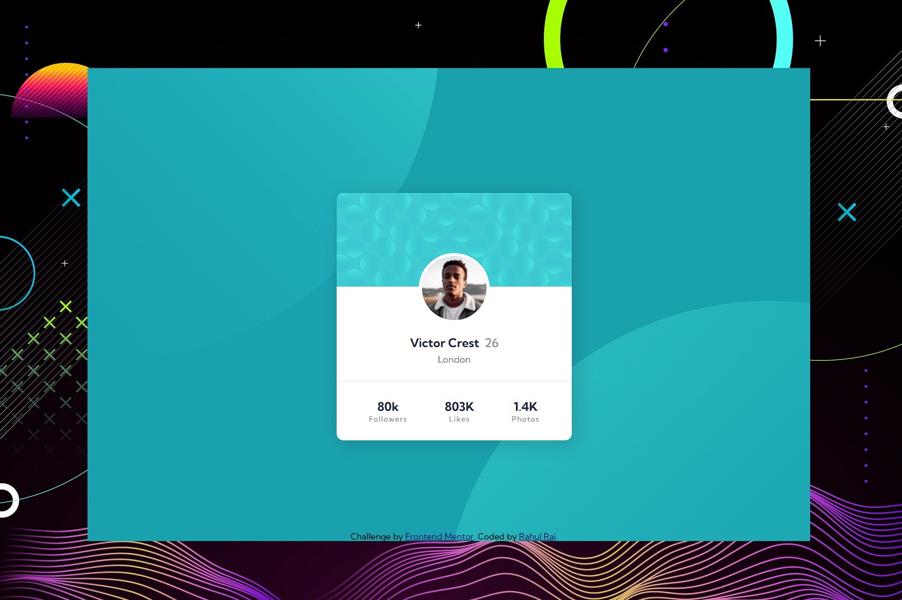

  

<h1 align="center">🧑‍💼 Profile Card Component 🧑‍💼</h1>

  
This is a solution to the <a href="https://www.frontendmentor.io/challenges/profile-card-component-cfArpWshJ">Profile card component challenge on Frontend Mentor</a>. Frontend Mentor challenges help you improve your coding skills by building realistic projects.

>Breathe life into your web profiles with this captivating Profile Card Component built with HTML and CSS. 🌟

## 🌐 Links
- [Solution](https://www.frontendmentor.io/solutions/profile-card-flexbox-layout-and-transformation-MfFAbItr9J) - Check out my solution on Frontend Mentor.
- [Live Site](https://lisztomania23.github.io/frontend-mentor-challenges/profile-card-component/) - Explore the live site to see the Profile Card Component in action.

## 💼 Features

- Create stunning profile cards for web profiles.
- Easily customizable design with HTML and CSS.
- Perfect for showcasing user information and statistics.

## 🧰 Built With

- **HTML**
- **CSS**
- **Flexbox**

## 🎓 What I Learned

Through this project, I learned and applied:

- CSS techniques for responsive design.
- Creative use of background images and positioning. 
  
`background-position: calc(50% - 510px) calc(50% - 390px), calc(50% + 470px) calc(50% + 500px)`

## 📚 Useful Resources

[Daily Dev Tips](https://daily-dev-tips.com/posts/css-offset-background-position/) - CSS Offset background-position

## 👤 Author

**Frontend Mentor**: [@lisztomania23](https://www.frontendmentor.io/profile/lisztomania23)

## 🙏 Acknowledgments

Big shoutout to Frontend Mentor for sparking inspiration for this project. Your challenges keep us creative and engaged. And, thanks to [Daily Dev Tips](https://daily-dev-tips.com/) for the insightful guide on CSS Offset background-position.
