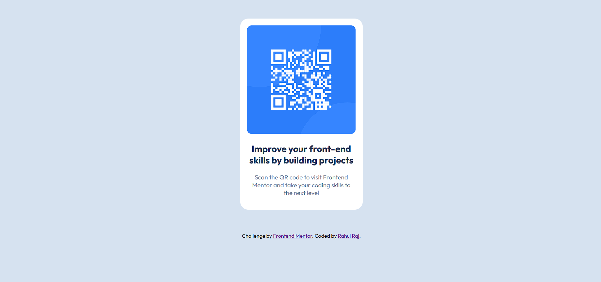
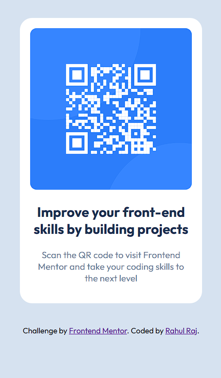

<h1>Frontend Mentor - QR Code Component Solution :)</h1>

This is a solution to the [QR code component challenge](https://www.frontendmentor.io/challenges/qr-code-component-iux_sIO_H) on Frontend Mentor. Frontend Mentor challenges help you improve your coding skills by building realistic projects.

## Table of Contents

- [Frontend Mentor - QR Code Component Solution :)](#frontend-mentor---qr-code-component-solution-)
  - [Table of Contents](#table-of-contents)
  - [Overview](#overview)
    - [Screenshot](#screenshot)
    - [Links](#links)
  - [My Process](#my-process)
    - [What I Learned](#what-i-learned)
    - [Useful Resources](#useful-resources)
  - [Author](#author)
  - [Acknowledgments](#acknowledgments)

## Overview
### Screenshot

### Links

- [Challenge Solution](https://www.frontendmentor.io/solutions/qr-code-component-using-flexbox-E7F_bd4Soq) - QR Code Component using Flexbox
- [Live Demo](https://lisztomania23.github.io/frontend-mentor-challenges/qr-code-component/) - See the live demo of the QR code component.

## My Process

### What I Learned
In this project, I learned how to:

- Structure a simple HTML page.
- Use flexbox for layout control.
- Utilize different CSS properties for text and element styling.

### Useful Resources
- [MDN Web Docs CSS Reference](https://developer.mozilla.org/en-US/docs/Web/CSS) - MDN's CSS reference is an invaluable resource for understanding and mastering CSS properties, values, and concepts.

## Author

- Frontend Mentor - [@lisztomania23](https://www.frontendmentor.io/profile/lisztomania23)

## Acknowledgments

I would like to thank the people and resources that helped me create this QR code component. My interest in web development began when I saw a friend working on a project with HTML and CSS. Their work inspired me to explore web development.

Completing the responsive web design course on [FreeCodeCamp](https://www.freecodecamp.org/riptidecoding) was a critical step in my learning process. It provided me with a solid foundation in HTML and CSS, which enabled me to confidently undertake this project.

The discovery of Frontend Mentor was a pivotal moment in my journey. I would like to extend my heartfelt appreciation to the communities on Frontend Mentor, [CodePen](https://codepen.io/), GitHub, and various forums. Your contributions, discussions, and code snippets were invaluable. Finally, I would like to acknowledge the instructors and instructional materials on Frontend Mentor. This project would not have been possible without your direction, from the project specifications to the GitHub publication. 

This QR code component represents the beginning of my web development journey, and I am deeply grateful for the support, knowledge, and inspiration I have received along the way. Thank you all for being a part of this exciting adventure.
